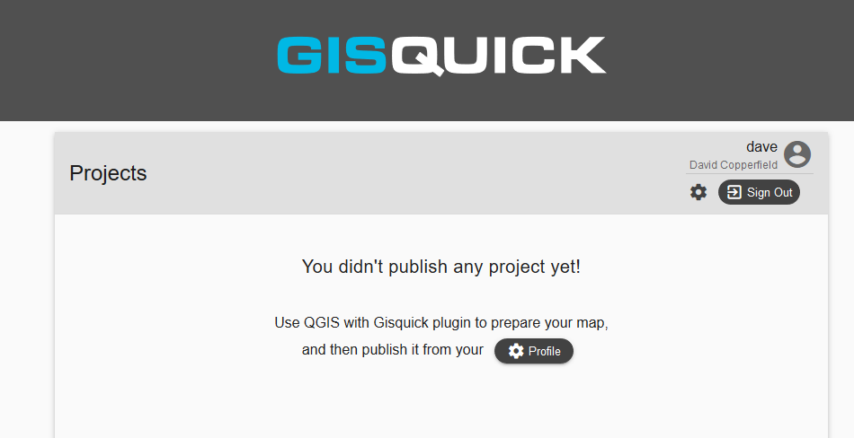

.. _creating-account:

================
Creating account
================

First of all, a new user account must be created on a publication
server (for example on Gisquick demo publication server as it is described below).
This can be done easily by filling the registration form available
at https://projects.gisquick.org/accounts/signup/.

.. figure:: ../img/gisquick-new-account-0.png
   :width: 60%

   Registration form for creating a new user account.

After pressing ``CREATE ACCOUNT`` button a confirmation mail should
be send to a given e-mail address.

.. figure:: ../img/gisquick-new-account-1.png
   :width: 75%

   Completion of registration process will be done by pressing
   ``ACTIVATE ACCOUNT`` button.

Afterwards, a new user is notified about successfull singing-in.

.. figure:: ../img/gisquick-new-account-2.png

   A new user account has been successfully created.

After clicking on ``CONTINUE`` button a new user will be redirected to
the publication server welcome screen.

.. figure:: ../img/gisquick-new-account-3.png
   :width: 50%

   Gisquick login screen.

The user can login using credentials (user name and password). After successful
login, Gisquick loads user's welcome page which includes list of already
published projects. After the very first login or in case that user hasn't
published any project yet, only the message appears stating how to proceed.

   User's welcome page after first login.