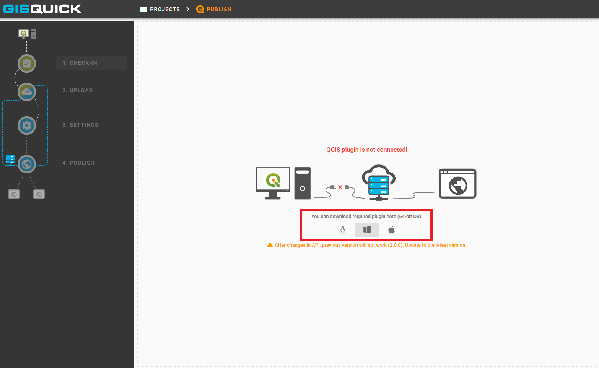
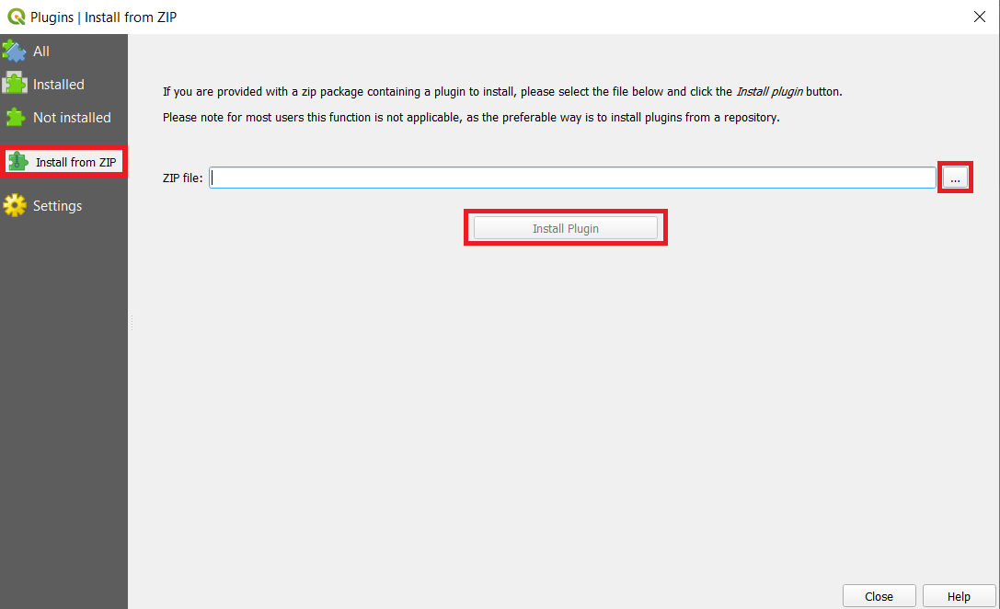
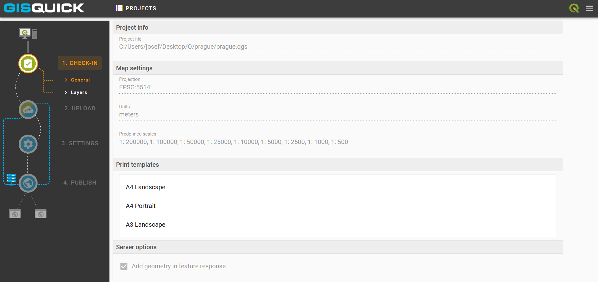

.. _experimental-publishing:

=======================
Experimental publishing
=======================

.. _experimental-preparing-project:

Preparing project
-----------------
Another so-called 'experimental' option how to publish project is described
in this part. Firstly, click on ``Publish`` button which is situated next to the
``Upload`` button in the user's project page. It allows to publish a project
directly from QGIS. In order to use this alternative, QGIS plugin needs to be
installed and connected. Required plugin is available to download for 64-bit OS
(Windows, Linux, Darwin).

.. figure:: ../img/publish-button/publish-button-1.png

   Placement of publish button.

   Where to download plugin for direct publishing from QGIS.

Once the download is complete, open QGIS and find tab ``Plugins`` and
choose ``Manage and install plugins``. Continue to the ``Install from
zip`` tab, set path to the downloaded zip file and hit install button.

   How to proceed in QGIS to install the experimental plugin.

When the installation is finished, it is possible to check new acquisition
in the list of installed plugins. Also, new icon appears in QGIS ribbon.
In comparison with classic Gisquick icon, it only differs in small digit 2
in the middle. Next step is to prepare the project in QGIS.

.. figure:: ../img/publish-button/publish-button-4.png
   :width: 75%

   List of installed plugins.

.. _experimental-uploading-project:

Uploading project
-----------------

Once the project is ready, click on experimental Gisquick plugin logo.
For the very first time, Gisquick asks user to fill in the connection
and Gisquick login details.

.. figure:: ../img/publish-button/publish-button-5.png
   :width: 50%

   Example of filled connection and login details.

After succesfull check-in to the Gisquick server, the project is screened
in user's experimental publish window. Notice, that the Gisquick 2
icon stays active in QGIS until user clicks on it again and interrupts the
connection with the server.

   Successful check-in to the Gisquick server and loaded sample project.

First section called ``CHECK-IN`` consists of two tabs and represents
an overview which is designed to easy check on loaded layers. It is not
possible to make any changes within these tabs. Eventual corrections
could be made back in QGIS.

First tab ``General`` includes some fundamental information about user's
project, e.g. map projection, units, predefined scales or print templates.
Second tab ``Layers`` contains list of layers with additional information.

When the project is checked and ready, proceed to the ``Upload`` section.
Two windows will split the screen: local project files are listed in the left,
intended server folder appears in the right one. Click on ``UPLOAD FILES`` button.

.. figure:: ../img/publish-button/publish-button-7.png
   :width: 75%

   Upload section displays local files and intended server folder.